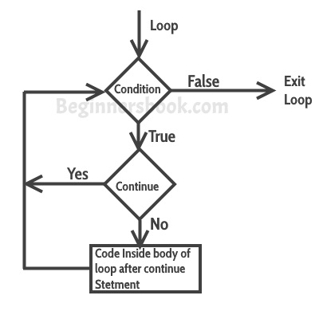

# C++中的continue语句示例
​	循环内部使用continue语句。每当在循环内部遇到continue语句时，控制直接跳转到下一次迭代的循环开头，跳过当前迭代的循环体内部的语句执行。

#### continue语句的语法

```cpp
continue;
```
## 例子：for循环内的continue语句
​	正如你所看到的，输出缺少了值3，但是[for循环](在C++中的for循环与示例.html)却对num值0到6进行了迭代。这是因为我们在循环中设置了一个条件，当num值等于3时，就会遇到continue语句。这是因为我们在循环中设置了一个条件，当num值等于3时，就会遇到continue语句，所以在这次迭代中，循环跳过了cout语句，开始了循环的下一次迭代。


```cpp
#include using namespace std;
int main(){
   for (int num=0; num<=6; num++) {
      /* 这意味着当num的值等于3时，会遇到这个continue语句，
       * 这将使控件跳转到下一次迭代的循环开始，跳过当前的迭代。
       */ 
     
      if (num==3) {
          continue;
      }
      cout<<num<<" ";
   }
   return 0;
}
```
  **输出：**


```cpp
0 1 2 4 5 6
```
## continue语句的流程图
  


## 例子: 在while循环中使用continue
```cpp
#include using namespace std;
int main(){
   int j=6;
   while (j >=0) {
      if (j==4) {
         j--;
         continue;
      }
      cout<<"Value of j: "<<j<<endl;
      j--;
   }
   return 0;
}
```
  **输出：**


```cpp
Value of j: 6
Value of j: 5
Value of j: 3
Value of j: 2
Value of j: 1
Value of j: 0
```
## 在do-while循环中continue的例子
```cpp
#include using namespace std;
int main(){
   int j=4;
   do {
      if (j==7) {
         j++;
         continue;
      }
      cout<<"j is: "<<j<<endl;
      j++;
   }while(j<10);
   return 0;
}
```
  **输出：**


```cpp
j is: 4
j is: 5
j is: 6
j is: 8
j is: 9
```
