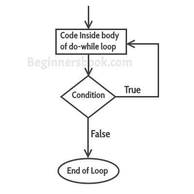

# C++中的do-while循环示例
​	正如上一篇关于[while循环](/contents/在C++中while循环的示例.html)的教程中所讨论的那样，循环用于重复一个语句块，直到给定的循环条件返回false为止。在本教程中，我们将看到do-while循环。do-while循环与while循环类似，但它们之间有区别。在 while 循环中，先执行条件，然后执行循环体中的语句，另一方面，在 do-while 循环中，先执行 do-while 中的语句，然后再执行条件。


#### do-while循环的语法
```cpp
do
{
   statement(s);
} while(condition);
```
## do-while循环如何工作？
​	首先，循环里面的语句执行，然后条件得到评估，如果条件返回真，那么控制跳转到 "do "进一步重复执行它，这样反复进行，直到条件返回假。一旦条件返回false，控制就会跳转到do-while之后的程序中的下一条语句。

   


## C++中的do-while循环示例
```cpp
#include using namespace std;
int main(){
   int num=1;
   do{
      cout<<"Value of num: "<<num<<endl;
      num++;
   }while(num<=6);
   return 0;
}
```
  **输出：**


```cpp
Value of num: 1
Value of num: 2
Value of num: 3
Value of num: 4
Value of num: 5
Value of num: 6
```
## 例子: 使用do-while循环显示数组元素
这里我们有一个有四个元素的整数组。我们使用do-while循环来显示其中的元素。


```cpp
#include using namespace std;
int main(){
   int arr[]={21,99,15,109};
   /* 数组索引以0开始，
    * 即数组的第一个元素在索引0处，arr[0] 。
    */
   int i=0;
   do{
      cout<<arr[i]<<endl;
      i++;
   }while(i<4);
   return 0;
}
```
  **输出：**


```cpp
21
99
15
109
```
