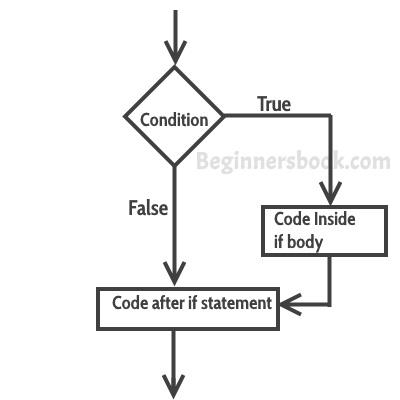

# C++中的if else语句
​	有时候，我们需要在满足或不满足某个特定条件时，才执行一个语句块。这就是所谓的**决策**，因为我们是在程序逻辑中做出决定后执行某段代码。在C++中，对于决策，我们有四种类型的控制语句（或控制结构），它们如下。


a) if语句

b) 嵌套if语句

c) if-else语句

d) if-else-if语句


## C++中的If语句
​	If语句由一个条件组成，后面是语句或一组语句，如下图所示：


```cpp
if(condition){
  Statement(s);
}
```
​	只有当给定的条件为真时，**if**括号内的语句（通常称为if body）才会被执行。如果条件为假，那么if body内的语句将被完全忽略。

  **If语句的流程图** 

   


### if语句的例子
```cpp
#include using namespace std;
int main(){
  int num=70;
  if( num < 100 ){
     /* 只有当上述条件为真时，
      * 这个cout语句才会被执行。
      */ 
     cout<<"number is less than 100";
  }
  if(num > 100){
     /* This cout statement will only execute,
      * if the above condition is true
      */ 
     cout<<"number is greater than 100";
  }
  return 0;
}
```
  **输出：**


```cpp
number is less than 100
```
## C++中的嵌套if语句
​	当一个if语句在另一个if语句中时，它被称为**嵌套if语句**。

​	嵌套if的结构是这样的。


```cpp
if(condition_1) {
   Statement1(s);
   if(condition_2) {
      Statement1(s);
   }
}
```
> 如果condition_1为真，Statement1将被执行。只有当条件( condition_1 和 condition_2)都为真时，才会执行语Statement1。


### 嵌套if语句的例子
```cpp
#include using namespace std;
int main(){
   int num=90;
   /* 嵌套的if语句。
    * 嵌套在另一个if主体中的if语句。
    */
   if( num < 100 ){
      cout<<"number is less than 100"<<endl;
      if(num > 50){
         cout<<"number is greater than 50";
      } 
   }
   return 0;
}
```
  **输出：**


```cpp
number is less than 100
number is greater than 50
```
## C++中的if else语句
​	有时你有一个条件，如果条件为真，你想执行一个代码块，如果相同的条件为假，则执行另一段代码。这在C++中可以使用if-else语句来实现。


​	这就是if-else语句的样子。


```cpp
if(condition) {
   Statement(s);
}
else {
   Statement(s);
}
```
​	如果条件为真，则执行 "if "里面的语句，如果条件为假，则执行 "else "里面的语句。

  **if-else的流程图** 

   


### if-else语句示例
```cpp
#include using namespace std;
int main(){
   int num=66;
   if( num < 50 ){
      //如果上述条件为真，将运行此代码
      cout<<"num is less than 50";
   }
   else {
      //如果上述条件为假，将运行此代码
      cout<<"num is greater than or equal 50";
   }
   return 0;
}
```
  **输出：**


```cpp
num is greater than or equal 50
```
## C++中的if-else-if语句
​	if-else-if 语句用于我们需要检查多个条件时。在这个控制结构中，我们只有一个 "if "和一个 "else"，但是我们可以有多个 "else if "块。这就是它的样子：


```cpp
if(condition_1) {
   /*如果condition_1为真，执行这个*/
   statement(s);
}
else if(condition_2) {
   /* 如果condition_1不满足而condition_2满足，则执行此操作。
    */
   statement(s);
}
else if(condition_3) {
   /* 如果condition_1和condition_2不满足，而condition_3满足，则执行此操作。
    */
   statement(s);
}
.
.
.
else {
   /* 如果条件都不为真，那么这些语句将被执行。
    */
   statement(s);
}
```
 **注意：** 这里最重要的一点是，在if-else-if中，只要满足条件，相应的一组语句就会被执行，其余的被忽略。如果没有满足任何条件，那么 "else "里面的语句就会被执行。


### if-else-if的例子
```cpp
#include using namespace std;
int main(){
   int num;
   cout<<"Enter an integer number between 1 &amp; 99999: ";
   cin>>num;
   if(num =1) {
      cout<<"Its a two digit number";
   }
   else if(num =100) {
      cout<<"Its a three digit number";
   }
   else if(num =1000) {
      cout<<"Its a four digit number";
   }
   else if(num =10000) {
      cout<<"Its a five digit number";
   }
   else {
      cout<<"number is not between 1 &amp; 99999";
   }
   return 0;
}
```
  **输出：**


```cpp
Enter an integer number between 1 &amp; 99999: 8976
Its a four digit number
```
