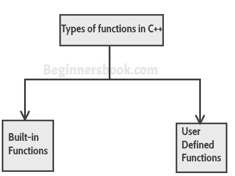
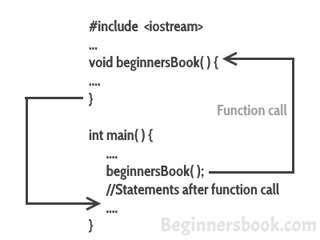

# C++中的函数与示例
​	函数是用来执行特定任务的代码块，比如说你正在编写一个大型的C++程序，在这个程序中，你想多次执行一个特定的任务，比如显示1到10的数值，为了做到这一点，你必须写几行代码，每次显示数值时，你都需要重复这几行代码。另一种方法是，你把这些行写在一个函数里面，每次你要显示数值的时候就调用这个函数。这将使你的代码变得简单、可读和可重用。


#### 函数的语法
```cpp
return_type function_name (parameter_list)
{
   //C++语句
}
```
​	我们举个简单的例子来理解这个概念。


## 一个简单的函数示例
```cpp
#include using namespace std;
// 此函数将两个整数值相加并返回结果。
int sum(int num1, int num2){
   int num3 = num1+num2; return num3;
}
int main(){
   //调用函数
   cout<<sum(1,99);
   return 0;
}
```
  **输出：**


```cpp
100
```
**同样的程序可以这样写：** 好，我写这个程序是为了让大家了解一个关于函数的重要名词，就是函数声明。让我们先看看这个程序，然后在程序的最后，我们将讨论函数的声明、定义和函数的调用。


```cpp
#include using namespace std;
//函数声明
int sum(int,int);
//主函数
int main(){
   //调用函数
   cout<<sum(1,99);
   return 0;
}
/* 函数定义在主方法之后
 */
int sum(int num1, int num2){
   int num3 = num1+num2;
   return num3;
}
```
**函数声明：** 你已经看到我用两种方式写了同一个程序，在第一个程序中，我没有任何函数声明，而在第二个程序中，我在程序的开头有函数声明。问题是，当你在程序中的main()函数之前定义了函数，那么你就不需要进行函数声明，但是如果你像我们在第二个程序中那样，在main()函数之后写函数，那么你就需要先声明函数，否则你会得到编译错误。


  **函数声明的语法：**


```cpp
return_type function_name(parameter_list);
```
**注意：** 在提供parameter_list时，你可以避免使用参数名，就像我在上面的例子中做的那样。我给出了`int sum(int,int);`而不是`int sum(int num1,int num2);`。

**函数定义：** 写出函数的全部内容称为定义函数。

**函数定义的语法：**


```cpp
return_type function_name(parameter_list) {
    //函数中的语句
}
```
**调用函数：** 我们可以这样调用函数。


```cpp
function_name(parameters);
```
  现在我们了解了**函数的工作原理**，让我们来看看C++中的函数类型。


## 函数的类型
  在C++中我们有两种类型的函数：

   

1) 内置函数

2）用户自定义函数


### 1) 内置函数
​	内置函数也就是所谓的库函数。我们不需要声明和定义这些函数，因为这些函数已经写在C++库中，如iostream、cmath等。我们在需要的时候可以直接调用它们。


#### 例子: C++内置函数示例
​	这里我们使用内置函数pow(x,y)，它是x对y的幂。这个函数在`cmath`头文件中声明，所以我们使用`#include`指令将该文件包含在我们的程序中。


```cpp
#include #include using namespace std;
int main(){
    /* 调用内置函数
     * 函数pow(x，y)，即x的y次幂。
     * 我们直接调用这个函数
     */
    cout<<pow(2,5);
    return 0;
}
```
  **输出：**


```cpp
32
```
### 2）用户自定义函数
  

​	我们已经看到了用户定义函数，本教程一开始所举的例子就是用户定义函数的一个例子。我们在程序中声明和编写的函数都是用户自定义函数。让我们再来看一个用户自定义函数的例子。


#### 用户自定义函数
```cpp
#include #include using namespace std;
//声明函数sum
int sum(int,int);
int main(){
   int x, y;
   cout<<"enter first number: ";
   cin>> x;
   cout<<"enter second number: ";
   cin>>y;
   cout<<"Sum of these two :"<<sum(x,y);
   return 0;
}
//定义函数sum
int sum(int a, int b) {
   int c = a+b;
   return c;
}
```
  **输出：**


```cpp
enter first number: 22
enter second number: 19
Sum of these two :41
```
