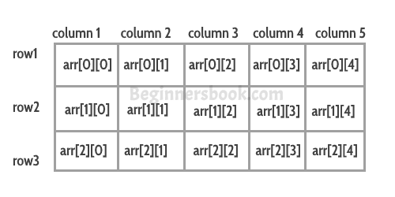

# C++中的多维数组
多维数组又称**数组**。多维数组中的数据以表格形式存储，如下图所示：

   


  **一个二维数组：**


```cpp
int arr[2][3];
```
​	这个数组共有2*3=6个元素。


  **一个三维数组：**


```cpp
int arr[2][2][2];
```
​	这个数组共有2*2*2=8个元素。


## 二维数组
让我们看看如何声明、初始化和访问二维数组元素。


  **如何声明一个二维数组？**


```cpp
int myarray[2][3];
```
  **初始化：** 
	我们可以用多种方式初始化数组：

 **方法 1:**


```cpp
int arr[2][3] = {10, 11 ,12 ,20 ,21 , 22};
```
  **方法 2:** 
	这种初始化的方式是首选，因为你可以在这里直观地看到行和列。


```cpp
int arr[2][3] = {{10, 11 ,12} , {20 ,21 , 22}};
```
  **访问数组元素：** 
```cpp
   arr[0][0] – first element

   arr[0][1] – second element

   arr[0][2] – third element

   arr[1][0] – fourth element

   arr[1][1] – fifth element

   arr[1][2] – sixth element
```


### 例子: C++中的二维数组
```cpp
#include using namespace std;
int main(){
   int arr[2][3] = {{11, 22, 33}, {44, 55, 66}};
   for(int i=0; i<2;i++){
      for(int j=0; j<3; j++){
        cout<<"arr["<<i<<"]["<<j<<"]: "<<arr[i][j]<<endl;
      }
   }
   return 0;
}
```
  **输出：**


```cpp
arr[0][0]: 11
arr[0][1]: 22
arr[0][2]: 33
arr[1][0]: 44
arr[1][1]: 55
arr[1][2]: 66
```
## 三维数组
让我们看看如何声明、初始化和访问三维数组元素。


  **声明一个三维数组：**


```cpp
int myarray[2][3][2];
```
  **初始化：** 
	我们可以用多种方式初始化数组：

 **方法 1:**


```cpp
int arr[2][3][2] = {1, -1 ,2 ,-2 , 3 , -3, 4, -4, 5, -5, 6, -6};
```
  **方法 2:** 
	这种初始化的方式是首选，因为你可以在这里直观地看到行和列。


```cpp
int arr[2][3][2] = {
     { {1,-1}, {2, -2}, {3, -3}},
     { {4, -4}, {5, -5}, {6, -6}}
}
```
## 三维数组实例
```cpp
#include using namespace std;
int main(){
   // 初始化数组
   int arr[2][3][2] = {
      { {1,-1}, {2,-2}, {3,-3} },
      { {4,-4}, {5,-5}, {6,-6} }
   };
   // 显示数组值 
   for (int x = 0; x < 2; x++) {
     for (int y = 0; y < 3; y++) {
       for (int z = 0; z < 2; z++) {
         cout<<arr[x][y][z]<<" ";
       }
     }
   }
   return 0;
}
```
  **输出：**


```cpp
1 -1 2 -2 3 -3 4 -4 5 -5 6 -6
```