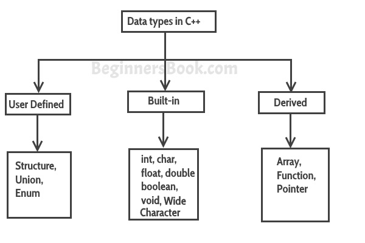

# C++中的数据类型
​	数据类型定义了一个[变量](/contents/C++中的变量.html)可以容纳的数据类型，例如一个整数变量可以容纳整数数据，一个字符类型变量可以容纳字符数据等。


​	C++中的数据类型分为三类。**内置** ，**用户自定义**和**衍生**。

   


## 内置数据类型
  **char** : 字符。大小为1个字节。


```cpp
char ch = 'A';
```
  **int** : 整数。大小为2个字节。


```cpp
int num = 100;
```
  **float** : 单精度浮点数。大小为4个字节。


```cpp
float num = 123.78987;
```
  **double** : 双精度浮点数。大小为8个字节。


```cpp
double num = 10098.98899;
```
  **bool** : 布尔值, true 或 false.


```cpp
bool b = true;
```
  **wchar_t** : 宽字符。应避免这样做，因为它的大小是由实现定义的，不可靠。


## 用户定义的数据类型
 在C++中，我们有三种类型的用户自定义数据类型。

   1. struct
   
   2. union
   
   3. enum


我已经在单独的教程中详细介绍了它们。现在只需记住，这些属于用户定义的数据类型。


## C++中的衍生数据类型
在C++中，我们有三种类型的派生定义数据类型。

   1. Array
   
   2. Function
   
   3. Pointer


它们是C++的广泛主题，我已经在单独的教程中介绍了它们。只要按照教程给定的顺序去做就可以了。


