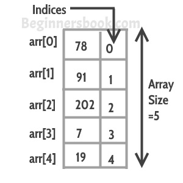

# C++中的数组
​	数组是存储在连续内存位置的类似项目的集合。在编程中，有时一个简单的变量不足以容纳所有的数据。例如，我们想存储500个学生的分数，有500个不同的变量来完成这个任务是不可行的，我们可以定义一个大小为500的数组，可以存储所有学生的分数。

   


## 在C++中声明一个数组
  有几种方法可以声明一个数组。

   方法1:


```cpp
int arr[5];
arr[0] = 10;
arr[1] = 20;
arr[2] = 30;
arr[3] = 40;
arr[4] = 50;
```
  方法 2:


```cpp
int arr[] = {10, 20, 30, 40, 50};
```
  方法 3:


```cpp
int arr[5] = {10, 20, 30, 40, 50};
```
## 访问数组元素
​	数组索引以0开始，这意味着第一个数组元素在索引0，第二个在索引1，以此类推。我们可以利用这些信息来显示数组元素。请看下面的代码：


```cpp
#include using namespace std;
int main(){
   int arr[] = {11, 22, 33, 44, 55};
   cout<<arr[0]<<endl;
   cout<<arr[1]<<endl;
   cout<<arr[2]<<endl;
   cout<<arr[3]<<endl;
   cout<<arr[4]<<endl;
   return 0;
}
```
  **输出：**


```cpp
11
22
33
44
55
```
​	虽然这段代码工作得很好，但不建议这样显示数组的所有元素。当你想访问某个特定的数组元素时，那么这样做是可以的，但是如果你想显示所有的元素，那么你应该使用这样的循环。


```cpp
#include using namespace std;
int main(){
   int arr[] = {11, 22, 33, 44, 55};
   int n=0;
  
   while(n<=4){
      cout<<arr[n]<<endl;
      n++;
   }
   return 0;
}
```
