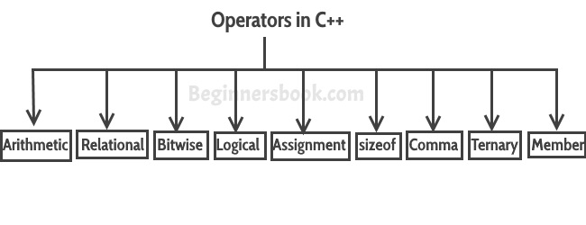

# C++中的运算符
​	操作符代表一个动作。例如，+是一个表示加法的运算符。一个运算符在两个或多个操作数上工作，并产生一个输出。例如3+4+5这里的+运算符在三个操作数上工作，并产生12的输出。


## C++中的运算符类型
  

​	1）基本算术运算符

​	2）赋值运算符

​	3）自增和自减运算符

​	4）逻辑运算符

​	5）比较（关系型）运算符

​	6）位操作符

​	7）三元运算符


## 1）基本算术运算符
基本的算术运算符有 +, -, *, /, %

`+ ` 代表加法。

`-` 是减法。

`*` 代表乘法。

`/` 是除法。

`%` 表示模数。

**注：** 模运算符返回余数，例如20 % 5将返回0。


### 算术运算符实例
```cpp
#include using namespace std;
int main(){
  int num1 = 240;
  int num2 = 40;
  cout<<"num1 + num2: "<<(num1 + num2)<<endl;
  cout<<"num1 - num2: "<<(num1 - num2)<<endl;
  cout<<"num1 * num2: "<<(num1 * num2)<<endl;
  cout<<"num1 / num2: "<<(num1 / num2)<<endl;
  cout<<"num1 % num2: "<<(num1 % num2)<<endl;
  return 0;
}
```
  **输出：**


```cpp
num1 + num2: 280
num1 - num2: 200
num1 * num2: 9600
num1 / num2: 6
num1 % num2: 0
```
## 2）赋值运算符
  C++中的赋值运算符有：=、+=、-=、*=、/=、%=。


  **num2=num1**会将变量num1的值赋给变量。


  **num2+=num1**等于num2=num2+num1。


  **num2-=num1**等于num2=num2-num1。


  **num2*=num1**等于num2=num2*num1。


  **num2/=num1**等于num2=num2/num1。


  **num2%=num1**等于num2=num2%num1。


### 赋值运算符示例
```cpp
#include using namespace std;
int main(){
 int num1 = 240;
 int num2 = 40;
 num2 = num1;
 cout<<"= Output: "<<num2<<endl;
 num2 += num1;
 cout<<"+= Output: "<<num2<<endl;
 num2 -= num1;
 cout<<"-= Output: "<<num2<<endl;
 num2 *= num1;      
 cout<<"*= Output: "<<num2<<endl;
 num2 /= num1;      
 cout<<"/= Output: "<<num2<<endl;
 num2 %= num1;      
 cout<<"%= Output: "<<num2<<endl;
 return 0;
}
```
  **输出：**


```cpp
= Output: 240
+= Output: 480
-= Output: 240
*= Output: 57600
/= Output: 240
%= Output: 0
```
## 3）自增和自减运算符示例
​	++和--

​	num++相当于num=num+1。


​	num--相当于num=num-1。


### 自增和自减运算符实例
```cpp
#include using namespace std;
int main(){
  int num1 = 240;
  int num2 = 40;
  num1++; num2--;
  cout<<"num1++ is: "<<num1<<endl;
  cout<<"num2-- is: "<<num2;
  return 0;
}
```
  **输出：**


```cpp
num1++ is: 241
num2-- is: 39
```
## 4）逻辑运算符
  逻辑运算符是与二元变量一起使用的，它们主要用于条件语句和循环，以评估条件。它们主要用在条件语句和循环中，用于评估一个条件。


  C++中的逻辑运算符有: &amp;&amp;, ||, !


  假设我们有两个布尔变量b1和b2。


  **b1&amp;&amp;b2** 如果b1和b2都为真，将返回true，否则将返回false。


  **b1||b2** 如果b1和b2都是false，将返回false，否则将返回true。


  **!b1** 会返回b1的相反值，也就是说，如果b1为假，它将为真，如果b1为真，它将返回假。


### 逻辑运算符实例
```cpp
#include using namespace std;
int main(){
   bool b1 = true;
   bool b2 = false;
   cout<<"b1 &amp;&amp; b2: "<<(b1&amp;&amp;b2)<<endl;
   cout<<"b1 || b2: "<<(b1||b2)<<endl;
   cout<<"!(b1 &amp;&amp; b2): "<<!(b1&amp;&amp;b2);
   return 0;
}
```
  **输出：**


```cpp
b1 &amp;&amp; b2: 0
b1 || b2: 1
!(b1 &amp;&amp; b2): 1
```
## 5）关系运算符
在C++中，我们有六个关系运算符: ==, !=, >, <, >=, <=


  **==** 如果左边和右边都相等，返回true。


  **!=** 如果左侧不等于右侧，返回true。


  **>** 如果左侧大于右侧，返回true。


  **<** 如果左侧小于右侧，返回true。


  **>=** 如果左侧大于或等于右侧，返回true。


  **<=** 如果左侧小于或等于右侧，返回true。


### 关系运算符的例子
```cpp
#include using namespace std;
int main(){
   int num1 = 240;
   int num2 =40;
   if (num1==num2) {
      cout<<"num1 and num2 are equal"<<endl;
   }
   else{
      cout<<"num1 and num2 are not equal"<<endl;
   }
   if( num1 != num2 ){
      cout<<"num1 and num2 are not equal"<<endl;
   }
   else{ 
      cout<<"num1 and num2 are equal"<<endl;
   }
   if( num1 > num2 ){
      cout<<"num1 is greater than num2"<<endl;
   }
   else{
      cout<<"num1 is not greater than num2"<<endl;
   }
   if( num1 >= num2 ){ 
      cout<<"num1 is greater than or equal to num2"<<endl;
   }
   else{
      cout<<"num1 is less than num2"<<endl;
   }
   if( num1 < num2 ){
      cout<<"num1 is less than num2"<<endl;
   }
   else{
      cout<<"num1 is not less than num2"<<endl;
   }
   if( num1 <= num2){
      cout<<"num1 is less than or equal to num2"<<endl;
   }
   else{
      cout<<"num1 is greater than num2"<<endl;
   }
   return 0;
}
```
  **输出：**


```cpp
num1 and num2 are not equal
num1 and num2 are not equal
num1 is greater than num2
num1 is greater than or equal to num2
num1 is not less than num2
num1 is greater than num2
```
## 6）位运算符
有六个位操作符：&amp;, |, ^, ~, <<, >>


```cpp
num1 = 11; /* equal to 00001011*/
num2 = 22; /* equal to 00010110 */
```
​	位运算符执行逐位处理。

**num1 & num2** 比较num1和num2的对应位，如果两个位都相等，则生成1，否则返回0。在我们的例子中，它会返回：2，即000010，因为在num1和num2的二进制形式中，只有第二个最后位是匹配的。

**num1 | num2** 比较num1和num2的对应位，如果其中一个位是1，则生成1，否则返回0。 在我们的例子中，它将返回31，即00011111。

**num1 ^ num2** 比较num1和num2的对应位，如果不相等则生成1，否则返回0。 在我们的例子中，它将返回29，相当于00011101。

**~num1** 是一个补码运算符，它只是将位从0变为1，将1变为0。在我们的例子中，它将返回-12，相当于11110100的8位有符号的操作符。

**num1 << 2** 左移运算符，它将位子向左移动，丢弃最左边的位子，并将最右边的位子赋值为0，在我们的例子中，输出是44，这相当于00101100


注意：在下面的例子中，我们在这个移位运算符的右侧提供了2，这就是比特向左侧移动两个位置的原因。我们可以改变这个数字，位将被移动的位数指定在右侧的操作符。同样的道理也适用于右边的运算符。

**num1 >> 2** 右移运算符，它将位子向右移动，丢弃最右边的位子，并将最左边的位子赋值为 0。


### 位运算符实例
```cpp
#include using namespace std;
int main(){
   int num1 = 11;  /* 11 = 00001011 */
   int num2 = 22;  /* 22 = 00010110 */ 
   int result = 0;
   result = num1 &amp; num2;
   cout<<"num1 &amp; num2: "<<result<<endl;
   result = num1 | num2;
   cout<<"num1 | num2: "<<result<<endl;
   result = num1 ^ num2;
   cout<<"num1 ^ num2: "<<result<<endl;
   result = ~num1;
   cout<<"~num1: "<<result<<endl;
   result = num1 << 2;
   cout<<"num1 << 2: "<<result<<endl;
   result = num1 >> 2;
   cout<<"num1 >> 2: "<<result;
   return 0;
}
```
  **输出：**


```cpp
num1 &amp; num2: 2
num1 | num2: 31
num1 ^ num2: 29
~num1: -12
num1 << 2: 44 num1 >> 2: 2
```
## 7）三元运算符
  这个运算符判断一个布尔表达式，并根据结果赋值。

   语法:


```cpp
variable num1 = (expression) ? value if true : value if false
```
 如果表达式的结果为真，那么冒号(:)前的第一个值被分配给变量num1，否则第二个值被分配给num1。


### 三元运算符实例
```cpp
#include using namespace std;
int main(){
  int num1, num2; num1 = 99;
  /* num1 is not equal to 10 that's why
   * the second value after colon is assigned
   * to the variable num2
   */
  num2 = (num1 == 10) ? 100: 200;
  cout<<"num2: "<<num2<<endl;
  /* num1 is equal to 99 that's why
   * the first value is assigned
   * to the variable num2
   */
  num2 = (num1 == 99) ? 100: 200;
  cout<<"num2: "<<num2;
  return 0;
}
```
  **输出：**


```cpp
num2: 200
num2: 100
```
## 其他操作符
​	在C++中还有其他一些运算符，如**逗号运算符**和**sizeof运算符**。我们将在另一个教程中详细介绍它们。


## C++中的运算符优先性
​	如果表达式有多个运算符，这将确定首先需要计算哪个运算符。具有较高优先级和较低优先级的运算符。

  **一元运算符** 

   `++ – – ! ~`

  **乘法式** 

   `* / %`

  **加法式** 

   `+ –`

  **移位** 

   `<< >> >>>`

  **关系** 

  `> >= < <=`

  **相等性** 

   `== !=`

  **按位与** 

   `&`

  **按位异或** 

   `^`

  **按位或** 

   `|`

  **逻辑与** 

   `&&`

  **逻辑或** 

   `||`

  **三元运算符** 

   `?:`

  **赋值** 

   `= += -= *= /= %= > >= < <= &= ^= |=`


