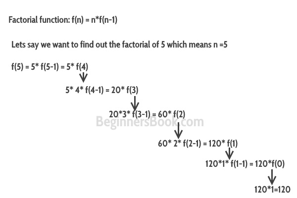

# C++ 递归与示例
​	函数调用自身的过程称为递归，对应的函数称为**递归函数**。理解递归的常用例子是阶乘函数。


​	**因式函数：** f(n) = n*f(n-1)，基本条件：如果n<=1，则f(n) = 1。别担心，我们将讨论什么是基本条件以及为什么它很重要。


​	在下图中，我已经证明了阶乘是如何进行的。我已经展示了阶乘函数如何调用自己，直到函数达到基本条件。


  


​	让我们用C++程序来解决这个问题吧。


## C++递归的例子：阶乘
```cpp
#include using namespace std;
//阶乘函数
int f(int n){
   /* 这就是所谓的基础条件，
    * 在递归中指定基础条件是非常重要的，
    * 否则你的程序会抛出堆栈溢出错误。
    */
   if (n <= 1)
        return 1;
   else 
       return n*f(n-1);
}
int main(){
   int num;
   cout<<"Enter a number: ";
   cin>>num;
   cout<<"Factorial of entered number: "<<f(num);
   return 0;
}
```
  **输出：**


```cpp
Enter a number: 5
Factorial of entered number: 120
```
### 基本条件
​	在上面的程序中，你可以看到我在递归函数中提供了一个基础条件。这个条件是：


```cpp
if (n <= 1)
        return 1;
```
​	递归的目的是将问题划分为更小的问题，直到达到基本条件。例如，在上面的阶乘程序中，我通过调用一个较小的阶乘函数f(n-1)来解决阶乘函数f(n)，这种情况反复发生，直到n值达到基本条件(f(1)=1)。如果你没有在递归函数中定义基本条件，那么你会得到堆栈溢出错误。


## 直接递归与间接递归的比较
​	**直接递归：** 当函数调用自己时，称为直接递归，上面我们看到的例子就是一个直接递归的例子。

​	**间接递归：** 当函数调用另一个函数，而该函数又调用调用函数时，则称为间接递归。例如：函数A调用函数B，函数B调用函数A。


### C++中的间接递归实例
```cpp
#include using namespace std;
int fa(int);
int fb(int);
int fa(int n){
   if(n<=1)
      return 1;
   else
      return n*fb(n-1);
}
int fb(int n){
   if(n<=1)
      return 1;
   else
      return n*fa(n-1);
}
int main(){
   int num=5;
   cout<<fa(num);
   return 0;
}
```
  **输出：**


```cpp
120
```
