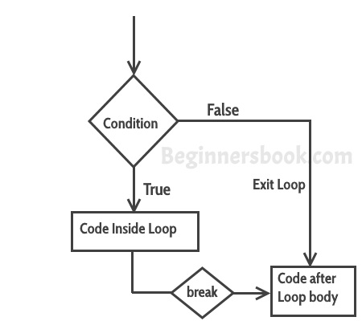

# 在C++中的break语句与示例
在以下两种情况下使用**break语句**。


  a) 使用break语句瞬间从循环中出来。只要在循环中遇到break语句，控件就会直接从循环中出来，终止循环。它与if语句一起使用，只要在循环中使用（见下面的例子），所以它只在特定条件下发生。


  b) 在case块之后的switch case控制结构中使用。一般来说，在switch case中的所有case后面都有break语句，以避免后续case（见下面的例子）的执行。只要在switch-case块中遇到它，控制就会从switch-case体中出来。


#### break 语句的语法
```cpp
break;
```
## break 语句流程图
  


## 例子：在while循环中使用break语句
​	在下面的例子中，我们有一个从10运行到200的while循环，但是由于我们有一个break语句，当循环计数器变量值达到12时，会遇到一个break语句，所以循环会被终止，控制跳转到循环体之后的程序中的下一条语句。


```cpp
#include using namespace std;
int main(){
   int num =10;
   while(num<=200) {
      cout<<"Value of num is: "<<num<<endl;
      if (num==12) {
         break;
      }
      num++;
   } 
   cout<<"Hey, I'm out of the loop";
   return 0;
}
```
  **输出：**


```cpp
Value of num is: 10
Value of num is: 11
Value of num is: 12
Hey, I'm out of the loop
```
## 例子：for循环中的break语句
```cpp
#include using namespace std;
int main(){
   int var;
   for (var =200; var>=10; var --) {
      cout<<"var: "<<var<<endl;
      if (var==197) {
         break;
      }
   }
   cout<<"Hey, I'm out of the loop";
   return 0;
}
```
  **输出：**


```cpp
var: 200
var: 199
var: 198
var: 197
Hey, I'm out of the loop
```
## 例子：Switch Case中的break语句
```cpp
#include using namespace std;
int main(){
   int num=2;
   switch (num) {
      case 1: cout<<"Case 1 "<<endl;
      break;
      case 2: cout<<"Case 2 "<<endl;
      break;
      case 3: cout<<"Case 3 "<<endl;
      break;
      default: cout<<"Default "<<endl;
   }
   cout<<"Hey, I'm out of the switch case";
   return 0;
}
```
  **输出：**


```cpp
Case 2 
Hey, I'm out of the switch case
```
​	在这个例子中，我们在每个Case块之后都有break语句，这是因为如果我们没有break语句，那么后续的case块也会执行。同样的程序在没有break的情况下，输出的结果是：


```cpp
Case 2
Case 3
Default
Hey, I'm out of the switch case
```
