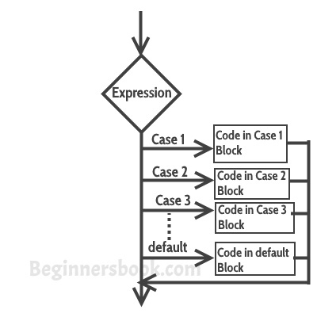

# 在C++中的switch case语句与示例
​	switch case语句用于当我们有多个条件，并且我们需要根据条件执行不同的操作时。当我们有多个条件，并且当某一条件被满足时，我们需要执行一组语句。在这种情况下，我们可以使用冗长的[if...else-if语句](/contents/C++中的if-else语句.html)或者切换case。冗长的if...else-if的问题是，当我们有几个条件时，它变得很复杂。switch case是处理这种情况的一种干净而有效的方法。


  **switch case语句**的语法:


```cpp
switch (variable or an integer expression)
{
     case constant:
     //C++ 代码
     ;
     case constant:
     //C++ 代码
     ;
     default:
     //C++ 代码
     ;
}
```
​	switch case 语句大多与break语句一起使用，尽管break语句是可选的。我们将首先看到一个没有break语句的例子，然后我们将讨论带有break语句的switch case。


## switch case的示例
```cpp
#include using namespace std;
int main(){
   int num=5;
   switch(num+2) {
      case 1: 
        cout<<"Case1: Value is: "<<num<<endl;
      case 2: 
        cout<<"Case2: Value is: "<<num<<endl;
      case 3: 
        cout<<"Case3: Value is: "<<num<<endl;
      default: 
        cout<<"Default: Value is: "<<num<<endl;
   }
   return 0;
}
```
  **输出：**


```cpp
Default: Value is: 5
```
**解释** 。在switch中，我给出了一个表达式，你也可以给出变量。我给出了表达式num+2，其中num的值是5，加法后表达式的结果是7，由于没有定义值为4的情况，所以执行了默认情况。


## switch case流程图
​	它评估表达式或变量的值（基于switch括号内给出的任何内容），然后根据结果执行相应的情况。

   


## switch case中的break语句
​	在讨论break语句之前，我们先来看看在switch case中不使用break语句会发生什么。请看下面的例子：


```cpp
#include using namespace std;
int main(){
   int i=2;
   switch(i) {
      case 1: cout<<"Case1 "<<endl;
      case 2: cout<<"Case2 "<<endl;
      case 3: cout<<"Case3 "<<endl;
      case 4: cout<<"Case4 "<<endl;
      default: cout<<"Default "<<endl; 
   }
   return 0;
}
```
  **输出：**


```cpp
Case2 
Case3 
Case4 
Default 
```
​	在上面的程序中，我们在switch括号内有变量i，这意味着无论变量i的值是多少，相应的case块都会被执行。我们把整数值2传给了switch，所以控制切换到了case 2，但是我们在case 2之后没有break语句，导致流向后续的case，直到结束。然而这并不是我们想要的，我们希望执行正确的case块，而忽略其余的块。解决这个问题的方法是在每个case块之后使用break语句。


​	当你希望你的程序流从switch体中出来时，就会用到break语句。每当在switch主体中遇到break语句时，执行流会直接从switch中出来，而忽略其余的case。这就是为什么你必须用break语句结束每个case块的原因。


​	让我们举个同样的例子，但这次是用break语句。


```cpp
#include using namespace std;
int main(){
   int i=2;
   switch(i) {
      case 1:
        cout<<"Case1 "<<endl;
        break;
      case 2:
        cout<<"Case2 "<<endl;
        break;
      case 3:
        cout<<"Case3 "<<endl;
        break;
      case 4:
        cout<<"Case4 "<<endl;
        break;
      default:
        cout<<"Default "<<endl;
    }
    return 0;
}
```
  **输出：**


```cpp
Case2
```
  现在你可以看到只有case2被执行了，其余的case都被忽略了。

  **为什么我在default后没有使用break语句？** 
   控件在default后自己会从switch中出来，所以我没有在后面使用break语句，不过如果你愿意你可以使用，这样做没有坏处。


## 重要注意事项
​	1）case不一定要有1、2、3等顺序。它可以在case关键字后有任何整数值。另外，case不需要总是按升序排列，你可以根据需求指定它们的任何顺序。


​	2）你也可以使用切换大小写的字符，例如——。


```cpp
#include using namespace std;
int main(){
   char ch='b';
   switch(ch) {
      case 'd': cout<<"Case1 ";
      break;
      case 'b': cout<<"Case2 ";
      break;
      case 'x': cout<<"Case3 ";
      break;
      case 'y': cout<<"Case4 ";
      break;
      default: cout<<"Default ";
   }
   return 0;
}
```
​	3）允许switch语句的嵌套，这意味着你可以在另一个switch里面有switch语句。但是应该避免嵌套switch语句，因为它使程序变得更复杂，可读性更低。


